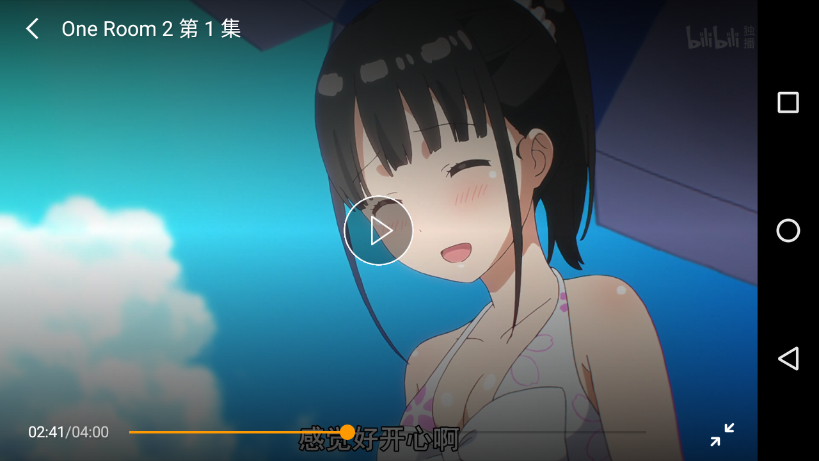

## react-native-ivideo

React-native-ivideo A component based on the react-native-video custom play bar. React Native > 0.40.0 is required.

[中文说明 -> 点这里](./CH_README.md)

> Currently, the performance is not tested on IOS.

characteristic:
- Basic playback features, friendly interface, progress control, and gradual animation.
- Fine-grained optimization, the UI thread can maintain 60 FPS during playback, and the JS thread can maintain 60 ~ 50 FPS.
- Provides full-screen playback.
- Supports formats such as MP4, M4A, FMP4, WebM, MKV, MP3, Ogg, WAV, MPEG-TS, MPEG-PS, FLV and ADTS (AAC).
- Support DASH, HlS and SmoothStreaming adaptive streaming.


<br />

#### Basic playback function, schedule control.


#### Full screen playback.



#### Fade out animation.


### Installation

React-native-ivideo uses react-native-video, react-native-orientation, and react-native-linear-gradient. You need to install these dependencies yourself.

installation:

```bash
yarn add react-native-ivideo
yarn add react-native-video
yarn add react-native-orientation
yarn add react-native-linear-gradient
```

link:

```bash
react-native link react-native-video
react-native link react-native-orientation
react-native link react-native-linear-gradient
```

### Usage

```js
import Video from 'react-native-ivideo';

<Video
    source={{ uri: url }}
    title={title}
    showFullscreenIcon={true}
    width='100%'
    height={240}
/>
```

### Example
Please check [example code](./example/index.js).


