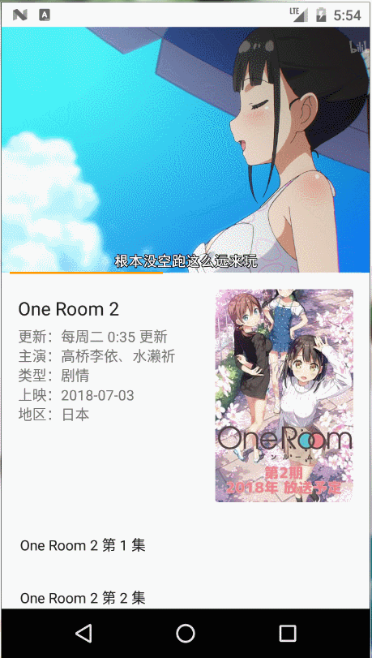

## react-native-ivideo
React-native-ivideo is a component based on the react-native-video custom play bar. React Native > 0.40.0 is required.

<a href="https://www.npmjs.com/package/react-native-ivideo"></a>
<a href="https://www.npmjs.com/package/react-native-ivideo"></a>


[中文说明 -> 点这里](./CH_README.md)

> Currently, the performance is not tested on IOS.

__characteristic:__
- Basic playback features, friendly interface, progress control, evolving animation, and simple style.
- Fine-grained optimization, the UI thread can maintain 60 FPS during playback, and the JS thread can maintain 60 ~ 55 FPS.
- Provides full-screen playback.
- Supports formats such as MP4, M4A, FMP4, WebM, MKV, MP3, Ogg, WAV, MPEG-TS, MPEG-PS, FLV and ADTS (AAC).
- Support DASH, HlS and SmoothStreaming adaptive streaming.


<br />

#### Basic playback function, schedule control.


#### Full screen playback.



#### Fade out animation.


### Installation

React-native-ivideo uses react-native-video, react-native-orientation, and react-native-linear-gradient. You need to install these dependencies yourself.

installation:

```bash
yarn add react-native-ivideo
```

link:

```bash
react-native link react-native-video
react-native link react-native-orientation
react-native link react-native-linear-gradient
```

modify the code in `android/build.gradle`:

```js
allprojects {
    repositories {
        mavenLocal()
        jcenter()
        maven {
            url 'https://maven.google.com'
        }
        maven {
            // All of React Native (JS, Obj-C sources, Android binaries) is installed from npm
            url "$rootDir/../node_modules/react-native/android"
        }
    }
}
```

### Usage

```js
import IVideo from 'react-native-ivideo';

<IVideo
    source={{ uri: url }}
    title='title'
    showFullscreenIcon={true}
    width='100%'
    height={240}
/>
```

### Example
Please check [example code](./example/index.js).


### Props

| name               | type          | default | description                              |
| :----------------- | :------------ | :------ | :--------------------------------------- |
| width              | number、string | 100%    | video width, __@required__.              |
| height             | number、string | 240     | video height, __@required__.             |
| source             | object        | null    | video data source, __@required__.        |
| toolbarDuration    | number        | 6000    | the toolbar displays the duration (ms).  |
| toolbarSliderColor | string        | #f90    | the color of the toolbar slider.         |
| title              | string        | ''      | the title displayed by the toolbar.      |
| showFullscreenIcon | bool          | false   | whether to display the full screen button. |
| autoPlay           | bool          | false   | whether to automatically start playback after the video initialization is completed. |

__Map to the properties of react-native-video:__

| name                   | type   | default | description                              |
| :--------------------- | :----- | :------ | :--------------------------------------- |
| progressUpdateInterval | number | 500     | The call time difference of onProgress (ms).  |
| playInBackground       | bool   | false   | whether the video is playing in the background. |
| muted                  | bool   | false   | whether it is muted.                     |
| rate                   | number | 1.0     | the rate at which the video plays.       |
| repeat                 | bool   | false   | whether to repeat the loop playback.     |
| resizeMode             | string | 'cover' | how the video fills the container.       |
| useTextureView         | bool   | false   | whether to use useTextureView.           |
| volume                 | number | 1.0     | The sound size of the video.             |

__event:__

| name               | type     | default | description                              |
| :----------------- | :------- | :------ | :--------------------------------------- |
| onProgress         | function | d => d  | video playback progress event.           |
| onBuffer           | function | d => d  | fires when the video is cached.          |
| onLoadStart        | function | e => e  | fires when the video is loadedstart.     |
| onLoad             | function | d => d  | fires when the video is loaded.          |
| onFullscreen       | function | e => e  | fires when the video enters full screen. |
| onCancelFullscreen | function | e => e  | fires when the video exits full screen.  |
| onPlay             | function | e => e  | fires when the video plays.              |
| onPause            | function | e => e  | fires when the video is paused.          |
| onEnd              | function | e => e  | fires when the video ends.               |
| onError            | function | e => e  | fires when an error occurs in video playback/loading. |


### Change log

